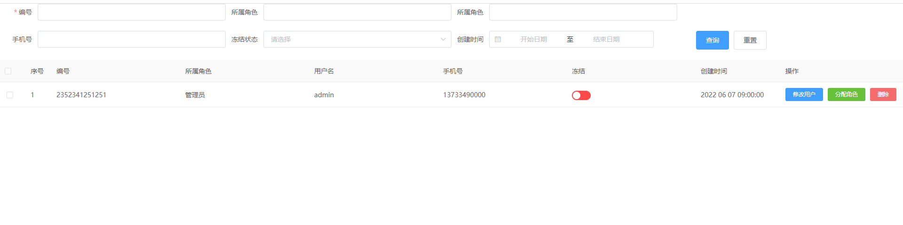

# MyForm

```
<my-form
      :form-data="postData"
      :form-config="formConfig"
      :form-btns="formBtns"
      :line-num="1"
      size="medium"
      @submit="handleSubmit"
      @reset="handleReset"
></my-form>
```

# 数据

## 请求参数 postData

## 表单配置 formConfig

## 表单按钮配置 formBtns

## 查询 重置 handleSubmit handleReset


```

postData: {
        id: "",
        role_name: "",
        uname: "",
        mobile: "",
        state: "",
        create_time: "",
      },
      formConfig: [
        [
          {
            type: "text",
            label: "编号",
            field: "id",
            rules: [
              { required: true, message: "请输入id", trigger: "blur" },
              {
                min: 3,
                max: 5,
                message: "长度在 3 到 5 个字符",
                trigger: "blur",
              },
            ],
          },
          { type: "text", label: "所属角色", field: "role_name", rules: [] },
          { type: "text", label: "所属角色", field: "uname", rules: [] },
        ],
        [
          { type: "text", label: "手机号", field: "mobile", rules: [] },
          {
            type: "select",
            label: "冻结状态",
            field: "state",
            isStatic: true,
            payload: "state",
            rules: [],
          },
          { type: "date", label: "创建时间", field: "create_time" },
        ],
      ],
      formBtns: [
        { type: "primary", content: "查询" },
        { type: "", content: "重置" },
      ],
```

```
methods: {
    handleSubmit() {
      console.log("查询");
    },
    handleReset() {
      console.log("重置");
    },
  },
```